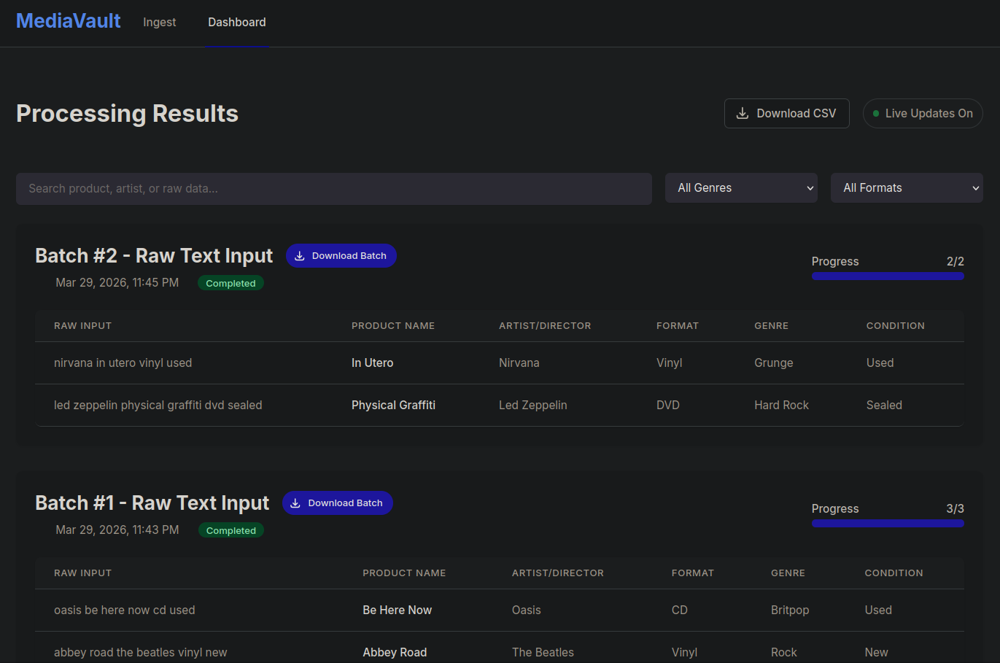

# MediaVault

MediaVault is an AI-powered, background-processed cataloging system built with **Laravel 11**. It is designed to ingest unstructured, messy physical media data (like raw string inputs of DVDs, CDs, and Vinyls) and utilize Agentic AI (Gemini API) to categorize and structure the data into clean, manageable JSON formats.



---

## Architectural Decisions & Strategy

When building MediaVault, one of primary focuses was on creating a highly scalable and maintainable architecture. To keep the architecture maintainable, I kept the controllers as lightweight as possible while offloading heavy lifting to dedicated service classes.

### 1. Asynchronous Background Queues
To prevent the web interface from freezing during intensive AI API calls, I utilized Laravel's **Database Queue Driver**. 
* When a batch is uploaded, a `MediaUploadService` instantly splits the input and creates database records.
* It then dispatches a unique `CategorizeMediaJob` for each individual item. 
* This allows the application to process dozens of API calls asynchronously in the background, keeping the UI completely responsive for the user.

### 2. Queue Resilience & Error Handling
In an eCommerce environment, dropped background processes result in lost data. A high priority was placed on making sure failed background jobs are properly caught.
* I implemented a `failed_jobs` table as a safety net.
* I also explicitly engineered the CategorizeMediaJob with a `failed(\Throwable $exception)` method to log the exact points of failure, making debugging much more efficient.

### 3. Native Http Facade vs. Raw cURL
To keep the codebase clean and testable, I entirely avoided raw cURL requests. I instead routed all external communication through Laravel's native Http facade. This also allowed me to implement built-in timeout handling `(->timeout(30))` cleanly.

### 4. Database Security & Mass Assignment
Security and structure are very important to me when dealing with unpredictable LLM outputs. I constructed all database tables strictly using Migrations, avoiding any manual table creation. Furthermore, all Eloquent models (`Batch`, `MediaItem`) strictly define their `$fillable` arrays. This prevents mass-assignment vulnerabilities which I felt was a critical safeguard when saving unstructured LLM data to a relational database.

---

## Agentic AI & Strict Prompt Engineering

All AI communication is isolated within the `MediaEnrichmentService`. Instead of relying on open-ended generation, the system utilizes **Strict Prompt Engineering** to enforce structure.

The AI is provided with a rigorous system prompt instructing it to act as a data processing specialist. It is forced to return **only** a valid JSON object containing specific keys:
* `product_name`
* `artist_or_director`
* `media_format`
* `genre`
* `condition`

I also explicitly instructed the LLM to safely default to null if it couldn't confidently determine a value, rather than guessing or hallucinating inaccurate data.

---

## Frontend: Live Polling & Dynamic UI

I built the frontend using Tailwind CSS and Alpine.js to create a reactive, modern eCommerce admin dashboard.
* **Live Progress Tracking:** The dashboard pings a dedicated JSON endpoint (`/dashboard/data`) every 3 seconds using Alpine's `setInterval`. 
* **Dynamic Filtering:** Progress bars, batch statuses, and data tables update in real-time as background queue workers complete their tasks. The filtering dropdowns dynamically populate only with valid categories that exist in the database.

---

## Setup & Installation

**Prerequisites:** PHP 8.3+, Composer, SQLite, and Node.js.

1. **Clone the repository:**
   ```bash
   git clone git@github.com:gabrieljamesknight/media-vault-laravel.git
   cd media-vault-laravel
   ```

2. **Install Dependencies:**
   ```bash
   composer install
   npm install && npm run build
   ```

3. **Environment Setup:**
   ```bash
   cp .env.example .env
   php artisan key:generate
   ```

4. **Run Database Migrations:**
   ```bash
   php artisan migrate
   ```

5. **Start the Application:**
   ```bash
   # Terminal 1: Start the web server
   php artisan serve

   # Terminal 2: Start the background queue worker
   php artisan queue:work
   ```

---

## Agentic AI Workflow & Developer Interventions

This project was built using an Agentic AI workflow (Gemini CLI) acting as a development partner. A core rule established in my `GEMINI.md` file was that I acted as the Architect, directing the AI's generation and intervening when its architectural choices degraded.

Included in this submission are my unedited chat transcripts (Sessions 1-7). Below are key highlights of this collaboration:

* **When the AI Excelled:** The AI was highly effective at rapidly generating boilerplate Laravel classes, standard Tailwind CSS views (Session 5), and scaffolding the initial database migrations and basic PHPUnit test structures.
* **Intervention 1 - Data Ingestion Logic (Session 4):** The AI initially attempted to feed massive, unsplit raw text strings directly to the LLM, which degraded the LLM's extraction accuracy. I intervened, diagnosed the database output, and forced the AI to refactor the ingestion logic to split strings by newlines (`\n` and `\r\n`) and dispatch individual background jobs per item.
* **Intervention 2 - Prompt Engineering Pivot (Session 4):** When the external Gemini API began hallucinating massive strings and ignoring instructions, I diagnosed that the `system_instruction` block in the REST payload was formatting incorrectly. I instructed the AI to delete that block and merge the strict JSON schema directly into the main `contents` array, which immediately stabilized the API responses.
* **Intervention 3 - Frontend Reactivity (Sessions 6 & 7):** The AI struggled with nuanced Alpine.js state management, initially creating duplicate dropdown filters and failing to make the UI reactive to background queue completions. I guided it to dynamically fetch distinct database values and pipe them through Alpine.js for true live polling.